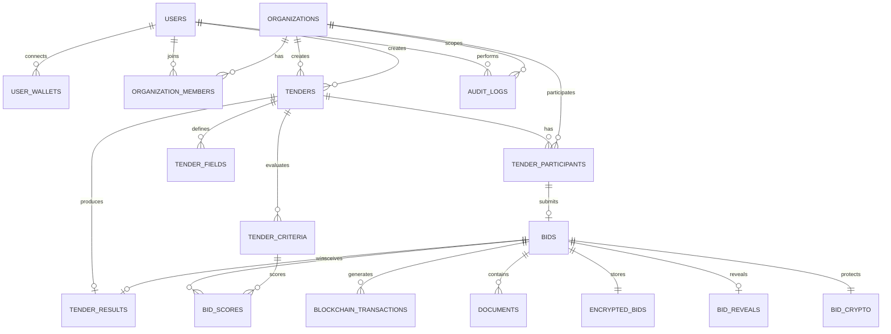
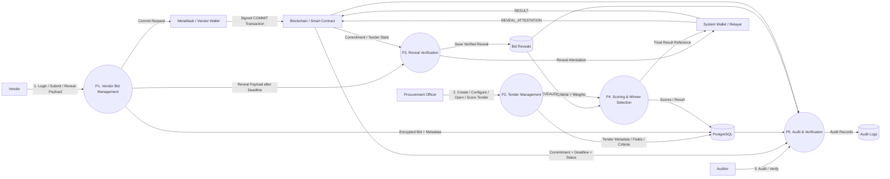

# TenderSeal

> **Secure Sealed Tendering for Trusted Procurement**

TenderSeal adalah platform **e-procurement / tender digital** yang dirancang untuk menjaga kerahasiaan penawaran vendor sampai batas waktu tender berakhir. Sistem menggabungkan **client-side encryption, commit-reveal, blockchain smart contract, dan audit trail** untuk mengurangi risiko kebocoran harga atau perubahan penawaran oleh pihak internal.

TenderSeal dirancang sebagai proyek Web Development untuk tema:

> **“NextGen Secure: Building the Future of Trusted Web Ecosystems”**

serta diarahkan pada kontribusi terhadap **SDG 16 – Peace, Justice and Strong Institutions**, dengan SDG 9 sebagai kontribusi pendukung melalui pemanfaatan teknologi digital dan blockchain.

---

## 1. Ringkasan Masalah

Dalam proses tender, vendor menyerahkan penawaran yang dapat berisi harga, spesifikasi teknis, waktu pengiriman, garansi, dokumen, dan informasi komersial lainnya.

Masalah utama yang ingin ditangani TenderSeal bukanlah agar vendor dapat melihat penawaran vendor lain. Pada kondisi normal, vendor memang **tidak mempunyai akses** ke bid kompetitor.

Risiko muncul ketika pihak internal yang mempunyai akses ke backend atau database dapat melihat **plaintext bid** sebelum batas akhir tender. Informasi tersebut berpotensi disalahgunakan, misalnya dengan membocorkan harga Vendor A kepada Vendor B agar Vendor B dapat menyesuaikan penawarannya.

Contoh:

```text
Vendor A → Rp1.150.000.000
Vendor B → Rp1.200.000.000

          ↓

Insider melihat bid A sebelum deadline

          ↓

Harga A dibocorkan kepada B

          ↓

Vendor B menurunkan bid
dan memperoleh keuntungan yang tidak fair
```

TenderSeal dirancang untuk menghilangkan ketergantungan terhadap kejujuran administrator sebagai satu-satunya pengaman kerahasiaan bid.

---

# 2. Akar Permasalahan

## 2.1 Plaintext bid berada di server

Pada sistem tender biasa, backend dapat menerima dan menyimpan data seperti:

```text
price = 1150000000
```

Jika database atau server dapat diakses oleh insider, data sensitif tersebut dapat dibaca sebelum deadline.

## 2.2 Deadline hanya menjadi aturan aplikasi

Jika deadline hanya diterapkan menggunakan logika backend:

```text
if currentTime < deadline:
    acceptBid()
```

maka aturan tersebut tetap bergantung pada server yang menjalankannya.

TenderSeal memindahkan sebagian aturan penting seperti **deadline, commitment, dan status tender** ke smart contract agar terdapat bukti dan aturan yang dapat diverifikasi secara independen.

## 2.3 Bid dapat diubah setelah submit

Selain kerahasiaan, sistem tender membutuhkan jaminan bahwa penawaran yang dibuka setelah deadline adalah penawaran yang sama dengan yang dikirim sebelum deadline.

Karena itu TenderSeal menggunakan **cryptographic commitment**.

---

# 3. Tujuan

Tujuan utama TenderSeal:

1. Menjaga agar isi bid tidak tersedia dalam bentuk plaintext di server sebelum deadline.
2. Memastikan bid yang di-reveal sesuai dengan bid yang telah di-commit sebelumnya.
3. Mencegah perubahan bid setelah submission tanpa terdeteksi.
4. Menyediakan deadline dan status tender yang dapat diverifikasi melalui smart contract.
5. Menyediakan audit trail melalui kombinasi database dan blockchain.
6. Menyediakan sistem tender yang fleksibel sehingga struktur bid dapat disesuaikan untuk setiap tender.

---

# 4. Solusi

TenderSeal menggunakan pendekatan berlapis:

```text
Client-Side Encryption
        +
Commit-Reveal
        +
Smart Contract
        +
Encrypted Backup
        +
Audit Trail
```

### Encryption

Data bid dienkripsi di sisi vendor sebelum dikirim ke backend.

### Commitment

Hash dari isi bid dan salt disimpan sebagai bukti bahwa isi bid sudah ditentukan sebelum deadline.

### Smart Contract

Blockchain digunakan untuk menyimpan aturan dan bukti penting seperti:

- tender ID
- deadline
- vendor wallet
- commitment
- status tender
- event submission/reveal
- hasil akhir yang relevan

### Encrypted Backup

Salinan bid disimpan dalam bentuk terenkripsi di server sehingga database tetap dapat digunakan untuk recovery tanpa menyimpan plaintext bid.

### PIN / Secret + KDF

Vendor dapat menggunakan PIN/secret sebagai input untuk **KDF (Key Derivation Function)** seperti Argon2id untuk menghasilkan kembali encryption key di sisi client.

> Catatan: implementasi produksi sebaiknya menggunakan secret yang cukup kuat. PIN pendek saja tidak boleh dianggap sebagai pengganti password/passphrase yang kuat.

---

# 5. Cara Kerja Sistem

## 5.1 Membuat Tender

Procurement Officer membuat tender:

```text
Judul
Deskripsi
Kategori
Deadline
Aturan
Kriteria penilaian
Bobot
Bid fields
```

Contoh:

```text
Tender: Pengadaan 100 Laptop

Kriteria:
- Harga       50%
- Spesifikasi 25%
- Garansi     15%
- Delivery    10%
```

Tender juga dapat mendefinisikan field bid secara dinamis.

## 5.2 Organisasi Penyelenggara Tender

TenderSeal dirancang sebagai platform **multi-organization**. Organisasi dari luar platform dapat mendaftar, membuat profil organisasi, dan memberikan permission `PROCUREMENT_OFFICER` kepada anggota organisasinya.

```text
User Baru
   ↓
Register
   ↓
Create / Join Organization
   ↓
Organization Membership
   ↓
PROCUREMENT_OFFICER
   ↓
Create Tender
```

`Tender` bukan role. `Vendor` juga bukan role global pada `users`. Vendor direpresentasikan sebagai organisasi penyedia yang mengikuti tender.

## 5.3 Peserta Tender

Sebelum mengirim bid, organisasi vendor harus menjadi peserta tender melalui `tender_participants`.

```text
Procurement Officer
        ↓
Publish Tender
        ↓
┌───────────────────────────┐
│ Tender terbuka             │
│ atau                       │
│ Vendor diundang            │
└─────────────┬─────────────┘
              ↓
      Vendor Organization
              ↓
      Accept / Eligible
              ↓
         Submit Bid
```

---

# 6. Dynamic Tender Fields

TenderSeal tidak menggunakan format bid yang selalu sama.

Administrator dapat membuat form sesuai jenis tender.

## Contoh A – Pengadaan Laptop

```text
Harga Total      → Currency
Brand            → Text
Processor        → Text
RAM              → Number
Storage          → Text
Garansi          → Number
Delivery         → Number
Proposal         → File
```

## Contoh B – Jasa Pembuatan Website

```text
Harga             → Currency
Durasi pengerjaan → Number
Jumlah developer  → Number
Teknologi         → Multi-select
Maintenance       → Number
Proposal          → File
```

Dengan pendekatan ini, sistem dapat digunakan untuk:

- pengadaan barang
- jasa
- proyek
- perangkat IT
- kendaraan
- kebutuhan operasional
- dan tender dengan struktur custom lainnya

---

# 7. Alur Submission

Submission bid dimulai setelah vendor menjadi participant yang eligible. Pada MVP, transaksi blockchain menggunakan wallet EVM milik user yang melakukan signing (misalnya MetaMask). Wallet digunakan untuk **identitas dan signing transaksi blockchain**, bukan untuk membayar nilai tender.

```text
Vendor User
   |
   v
Login TenderSeal
   |
   v
Pilih Tender
   |
   v
Input Bid
   |
   +--> Generate Bid Salt
   |
   +--> Input Secret / PIN
   |
   v
Argon2id(Secret + KDF Salt)
   |
   v
Encryption Key (K)
   |
   +--> Encrypt(Bid + Bid Salt)
   |        |
   |        v
   |   Encrypted Bid
   |        |
   |        v
   |     Backend
   |        |
   |        v
   |    PostgreSQL / Object Storage
   |
   +--> Hash(Tender ID + Vendor Organization + Bid + Bid Salt)
            |
            v
       Commitment Hash
            |
            v
       Wallet Sign Transaction
            |
            v
       Smart Contract
```

Server menerima **encrypted bid**, bukan plaintext bid. Commitment dicatat sebagai bukti integritas; transaksi blockchain menyimpan referensi on-chain seperti `tender_id`, commitment, wallet pengirim, dan timestamp.

---

# 8. Commit-Reveal

Commit-reveal digunakan untuk membuktikan bahwa isi bid yang dibuka setelah deadline adalah bid yang sama dengan yang dikunci sebelum deadline.

## 8.1 Commit

Sebelum deadline:

```text
commitment =
Hash(
    tender_id +
    vendor_organization_id +
    bid_data +
    bid_salt
)
```

Commitment dikirim ke smart contract melalui transaksi blockchain. Blockchain menyimpan commitment, tetapi **tidak menyimpan plaintext bid**.

```text
Plaintext Bid
     |
     v
   Hash
     |
     v
Commitment ─────────→ Blockchain

Encrypted Bid ──────→ PostgreSQL / Object Storage
```

## 8.2 Reveal

Setelah deadline, vendor mengambil kembali encrypted bid, merekonstruksi encryption key secara client-side, lalu melakukan decrypt.

```text
Encrypted Bid
      |
      v
Decrypt di Client
      |
      v
Bid + Bid Salt
      |
      v
Kirim Reveal Payload → Backend
                           |
                           v
                 Hitung Hash Ulang
                           |
                           v
                 Compare dengan
                 Commitment On-Chain
                           |
                 ┌─────────┴─────────┐
                 ▼                   ▼
              VALID               INVALID
```

### 8.3 Blockchain Reveal

Pada MVP, **plaintext bid tidak dikirim ke public blockchain**. Backend melakukan verifikasi terhadap commitment yang sudah tercatat, kemudian mencatat **reveal attestation/reference** ke smart contract.

```text
Reveal Payload
(Bid + Bid Salt)
      |
      v
Backend Verify
      |
      +---- INVALID → reject + audit log
      |
      v
Valid Reveal
      |
      v
Record Reveal Attestation
      |
      v
Smart Contract
```

Dengan model ini, blockchain berfungsi sebagai **anchor integritas dan status**, sedangkan data bid yang dapat dibaca manusia tetap berada di backend setelah fase reveal. Untuk kebutuhan verifikasi yang lebih kuat tanpa membuka data ke blockchain, zero-knowledge proof dapat dipertimbangkan sebagai future work.

---

# 9. Encrypted Backup

Karena tender dapat berlangsung lama, data penting untuk reveal **tidak disimpan hanya di localStorage browser**.

Sebaliknya:

```text
Bid + Bid Salt
      |
      v
Encrypt with Key K
      |
      v
Encrypted Bid
      |
      v
PostgreSQL / Object Storage
```

Server tidak menyimpan plaintext:

```text
❌ Harga plaintext
❌ Bid Salt plaintext
❌ PIN plaintext
❌ Encryption Key plaintext
```

Server menyimpan:

```text
✓ Encrypted Bid
✓ KDF Salt
✓ Commitment
✓ Tender ID
✓ Vendor ID
✓ Metadata
```

---

# 10. Bagaimana Vendor Mendapatkan Kembali Encryption Key?

Encryption key tidak harus disimpan sebagai secret permanen di database.

TenderSeal dapat merekonstruksinya di sisi client:

```text
Vendor Secret
      +
KDF Salt
      |
      v
   Argon2id
      |
      v
Encryption Key K
```

Karena KDF bersifat deterministik untuk input yang sama, vendor dapat menghasilkan key yang sama ketika melakukan recovery dari browser atau perangkat lain.

Contoh:

```text
PIN/Secret = <vendor secret>
KDF Salt   = <stored salt>

Argon2id(PIN/Secret, KDF Salt)
              |
              v
              K
```

KDF salt tidak perlu dirahasiakan; yang harus dirahasiakan adalah secret vendor.

## 10.1 Wallet dan Transaksi Blockchain

TenderSeal dapat menggunakan wallet EVM seperti MetaMask pada MVP untuk menandatangani **transaksi COMMIT** secara langsung dari sisi vendor. Fase reveal tidak lagi membutuhkan signature wallet vendor.

```text
Vendor
  |
  v
TenderSeal Frontend
  |
  v
Wallet (mis. MetaMask)
  |
  v
Sign COMMIT Transaction
  |
  v
Blockchain RPC
  |
  v
Smart Contract
```

Untuk **Reveal Attestation**, backend yang melakukan verifikasi dan mengirim transaksi ke smart contract melalui wallet/relayer milik sistem.

Wallet vendor digunakan untuk:

- menyediakan `wallet_address` sebagai identitas blockchain;
- menandatangani transaksi `COMMIT` sebelum deadline.

Wallet vendor **tidak diperlukan untuk reveal** pada desain MVP ini.

**Nilai penawaran tender tidak dibayar menggunakan crypto.** Jika ada pembayaran komersial setelah pemenang ditetapkan, mekanismenya dapat dilakukan melalui metode pembayaran yang ditentukan oleh organisasi, termasuk transfer bank.

Untuk MVP, user tetap dapat menggunakan UI TenderSeal tanpa harus memahami detail Solidity atau blockchain; wallet hanya muncul ketika signature transaksi dibutuhkan.

---

# 11. Alur Setelah Deadline

Setelah commit deadline tercapai, tender masuk ke fase `CLOSED` dan reveal window dibuka.

```text
TENDER OPEN
    |
    | Vendor submit
    v
BID SEALED
    |
    | commit deadline tercapai
    v
TENDER CLOSED
    |
    v
REVEAL WINDOW
    |
    +--> Vendor Login
    |
    +--> Input Secret / PIN
    |
    +--> Rekonstruksi Key (Argon2id)
    |
    +--> Ambil Encrypted Bid
    |
    +--> Decrypt di Client
    |
    +--> Kirim Reveal Payload ke Backend
    |
    +--> Backend Verify Commitment
    |        |
    |        +---- INVALID → REJECTED
    |        |
    |        v
    |      VALID
    |        |
    |        +--> Update Bid Status
    |        |
    |        +--> Record Reveal Attestation ke Blockchain
    |
    v
REVEAL WINDOW CLOSED
    |
    v
SCORING
    |
    v
WINNER SELECTION (Manual Finalize oleh Panitia)
    |
    v
RESULT RECORDED TO SMART CONTRACT
```

### 11.1 Bagaimana Plaintext Bid Dipakai untuk Scoring?

Setelah deadline dan setelah reveal berhasil diverifikasi, plaintext bid **boleh tersedia di sisi server untuk tahap evaluasi**, karena perlindungan kerahasiaan yang ditargetkan adalah mencegah akses sebelum deadline.

```text
Vendor Client
     |
     | Reveal Payload
     v
Backend
     |
     +--> Verify Commitment
     |
     +--> Save verified reveal data
     |
     v
Scoring Engine
     |
     v
Procurement Officer / Evaluator
```

Data hasil reveal yang diperlukan untuk scoring disimpan pada tabel `bid_reveals` agar metadata sealed bid tetap terpisah dari payload yang sudah dibuka.

---

# 11.2 Reveal Window & Kebijakan Fallback

## Kenapa Dibutuhkan

Fase commit sudah memiliki deadline yang tegas dan dijaga oleh smart contract (Section 2.2, 8). Namun fase reveal pada rancangan awal tidak memiliki batas waktu. Jika satu vendor tidak pernah melakukan reveal, tender berisiko menggantung tanpa kepastian kapan proses scoring dapat dijalankan.

Ada dua kondisi berbeda yang perlu ditangani:

- **Vendor kehilangan secret/PIN** (Section 19.2) — kegagalan reveal yang tidak disengaja.
- **Vendor sengaja tidak reveal** — misalnya karena vendor menduga bid-nya tidak kompetitif, lalu memilih diam agar proses tender terganggu atau harus diulang.

Secara teknis, dari sudut pandang blockchain, kedua kondisi ini tidak dapat dibedakan: keduanya sama-sama tercatat sebagai "tidak ada transaksi reveal yang masuk". TenderSeal tidak berusaha menebak niat vendor secara otomatis, karena itu bukan keputusan yang bisa diambil secara deterministik oleh smart contract. Sebagai gantinya, kedua kondisi diberi konsekuensi teknis yang sama, sementara proses banding tetap dapat ditempuh secara administratif di luar smart contract.

## Reveal Window

Reveal window adalah batas waktu tetap yang mulai berjalan begitu status tender berubah menjadi `CLOSED`. Smart contract menolak reveal setelah `reveal_deadline`; backend/automation memicu penutupan fase reveal dan memperbarui status lokal setelah deadline terlewati.

```text
Commit Deadline: 15:00
     |
     v
Tender CLOSED
     |
     v
[ Reveal Window dibuka: 15:00 ]
     |
     +--> Vendor A reveal jam 15:05  -> REVEALED_VALID
     +--> Vendor B reveal jam 15:10  -> REVEALED_VALID
     +--> Vendor C reveal jam 15:20  -> REVEALED_VALID
     +--> Vendor D tidak reveal
     |
     v
[ Reveal Window ditutup: 15:00 + 48 jam ]
     |
     v
Backend/automation menandai bid yang
belum reveal sebagai NOT_REVEALED dan dapat mencatat penutupan reveal window ke smart contract
     |
     v
Scoring berjalan hanya untuk bid
berstatus REVEALED_VALID
```

Durasi reveal window (contoh: 48 jam) ditentukan oleh Procurement Officer saat tender dibuat, sama seperti penentuan commit deadline pada Section 5.1.

## Status Reveal per Vendor

| Status | Kondisi |
|---|---|
| `REVEALED_VALID` | Hash(reveal) sama dengan commitment, diterima dalam reveal window |
| `REVEALED_INVALID` | Vendor melakukan reveal, tetapi hash tidak cocok dengan commitment — indikasi bid diubah setelah commit |
| `NOT_REVEALED` | Tidak ada transaksi reveal sampai reveal window tertutup, baik karena secret hilang maupun sengaja tidak reveal |

Hanya bid berstatus `REVEALED_VALID` yang diteruskan ke tahap scoring (Section 5, Sprint 5).

## Tender Tidak Boleh Tersandera oleh Satu Vendor

Tender tetap dilanjutkan ke tahap scoring selama terdapat minimal satu bid berstatus `REVEALED_VALID`. Vendor berstatus `NOT_REVEALED` otomatis dinyatakan gugur dan tidak menghentikan proses tender secara keseluruhan. Aturan ini mencegah satu vendor — baik karena kelalaian maupun kesengajaan — menyandera seluruh proses tender.

## Kenapa Bukan Auto-Decrypt Setelah Deadline

Alternatif yang mungkin terlihat lebih sederhana: sistem otomatis membuka seluruh bid begitu deadline tercapai, tanpa perlu vendor login untuk reveal.

Pendekatan ini bertentangan langsung dengan threat model TenderSeal (Section 2, 18). Encryption key diturunkan dari secret vendor secara client-side (Section 10) dan server tidak pernah menyimpan maupun memiliki key tersebut. Jika sistem dibuat mampu men-decrypt secara otomatis, berarti ada satu titik dalam sistem yang memiliki kemampuan membuka bid tanpa keterlibatan vendor — ini mereplikasi celah insider access yang sejak awal ingin dihilangkan oleh TenderSeal.

## Future Work: Threshold Secret Sharing

Di luar cakupan MVP ini, reveal window dengan fallback gugur dapat dilengkapi dengan skema threshold secret sharing (misalnya Shamir's Secret Sharing). Encryption key dipecah menjadi beberapa bagian yang didistribusikan ke pihak-pihak independen (vendor, Procurement Officer, Auditor), dengan aturan kuorum minimum (misalnya 2 dari 3 bagian) untuk merekonstruksi key tanpa satu pihak pun dapat membukanya sendirian. Pendekatan ini berpotensi menangani kasus vendor kehilangan secret secara permanen tanpa mengorbankan prinsip "tidak ada single point of decrypt", namun menambah kompleksitas implementasi dan koordinasi antar pihak yang signifikan, sehingga tidak dimasukkan pada skala demo/kompetisi ini.

---

# 11.3 Ringkasan Transaksi MVP

Pada TenderSeal, istilah "transaksi" dibedakan menjadi transaksi bisnis dan transaksi blockchain.

| Jenis | Contoh | Fungsi |
|---|---|---|
| Transaksi bisnis | Submit bid, reveal, scoring, penetapan hasil | Proses tender di aplikasi |
| Transaksi blockchain | `COMMIT`, `REVEAL_ATTESTATION`, `TENDER_STATE`, `RESULT` | Bukti/status proses yang dicatat on-chain |

Vendor **tidak mengirim nilai bid dalam bentuk crypto** ketika melakukan submission. Wallet digunakan untuk signing transaksi blockchain dan, pada jaringan yang memerlukan gas, membayar biaya transaksi jaringan.

---

# 12. Mengapa Blockchain Digunakan?

Blockchain tidak digunakan untuk menyimpan semua data aplikasi.

Blockchain digunakan hanya untuk data yang membutuhkan:

- verifiability
- immutability
- timestamp
- auditability
- enforcement terhadap aturan tertentu

Data sensitif dan data operasional tetap berada di backend/database.

## Data di Blockchain

Contoh:

```text
Tender ID
Deadline
Vendor Wallet
Commitment
Status
Bid submission transaction
Reveal transaction
Final result reference
```

## Data di PostgreSQL

Data operasional, data organisasi, metadata tender, encrypted bid, metadata dokumen, dan audit log disimpan di PostgreSQL.

Contoh:

```text
Users
Organizations
Organization Members
Tenders
Tender Participants
Tender Fields
Tender Criteria
Bids
Bid Cryptography Metadata
Encrypted Bids
Documents Metadata
Blockchain Transactions
Bid Scores
Tender Results
Audit Logs
```

### 12.1 Prinsip Multi-Organization

TenderSeal dirancang agar tidak hanya digunakan oleh satu instansi. Organisasi dari luar platform dapat mendaftar dan membuat tender selama memiliki akun dengan permission `PROCUREMENT_OFFICER` pada organisasi tersebut.

Struktur dasarnya:

```text
User
  |
  v
Organization Membership
  |
  +--> ORGANIZATION_ADMIN
  +--> PROCUREMENT_OFFICER
  +--> AUDITOR
  +--> MEMBER

Organization
  |
  +--> BUYER
  +--> VENDOR
  +--> BOTH
```

`VENDOR` tidak diperlakukan sebagai role global. Vendor merupakan organisasi yang berpartisipasi sebagai penyedia pada suatu tender. User yang bekerja di organisasi vendor tetap tercatat sebagai member organisasi tersebut.

### 12.2 Struktur Database PostgreSQL

| Tabel | Fungsi utama |
|---|---|
| `users` | Akun dan identitas autentikasi pengguna |
| `user_wallets` | Wallet EVM yang terhubung ke user untuk signing blockchain |
| `organizations` | Data perusahaan/instansi yang menggunakan TenderSeal |
| `organization_members` | Keanggotaan user pada organisasi dan role-nya |
| `tenders` | Data utama tender |
| `tender_participants` | Daftar organisasi vendor yang mengikuti tender |
| `tender_fields` | Konfigurasi dynamic field bid |
| `tender_criteria` | Kriteria dan bobot penilaian |
| `bids` | Metadata dan status setiap bid |
| `bid_reveals` | Data bid yang sudah di-reveal dan lolos verifikasi untuk scoring |
| `bid_crypto` | Metadata KDF, salt, IV, dan algoritma kriptografi |
| `encrypted_bids` | Ciphertext bid yang disimpan di server/object storage |
| `documents` | Metadata proposal/dokumen vendor |
| `blockchain_transactions` | Referensi transaksi commit dan reveal attestation blockchain |
| `bid_scores` | Nilai bid berdasarkan kriteria |
| `tender_results` | Hasil akhir dan pemenang tender |
| `audit_logs` | Riwayat aktivitas dan audit trail |

### 12.3 Detail Field Database

#### `users`

| Field | Tipe | Keterangan |
|---|---|---|
| `id` | UUID | Primary key |
| `name` | VARCHAR(150) | Nama pengguna |
| `email` | VARCHAR(255) | Email unik |
| `password_hash` | TEXT | Password yang sudah di-hash |
| `is_active` | BOOLEAN | Status akun |
| `created_at` | TIMESTAMP | Waktu dibuat |
| `updated_at` | TIMESTAMP | Waktu diperbarui |

#### `user_wallets`

Menyimpan wallet blockchain yang terhubung ke user. Wallet bukan atribut wajib organisasi.

| Field | Tipe | Keterangan |
|---|---|---|
| `id` | UUID | Primary key |
| `user_id` | UUID | FK → `users.id` |
| `wallet_address` | VARCHAR(100) | Alamat wallet EVM |
| `chain_id` | BIGINT | ID jaringan blockchain |
| `is_primary` | BOOLEAN | Wallet utama user |
| `created_at` | TIMESTAMP | Waktu terhubung |
| `updated_at` | TIMESTAMP | Waktu diperbarui |

User dapat memiliki lebih dari satu wallet. Wallet yang benar-benar melakukan transaksi dicatat kembali pada `blockchain_transactions.wallet_address`.

#### `organizations`

| Field | Tipe | Keterangan |
|---|---|---|
| `id` | UUID | Primary key |
| `name` | VARCHAR(200) | Nama perusahaan/instansi |
| `type` | ENUM | `BUYER`, `VENDOR`, `BOTH` |
| `legal_identifier` | VARCHAR(100) | Identitas organisasi bila diperlukan |
| `email` | VARCHAR(255) | Email organisasi |
| `phone` | VARCHAR(50) | Kontak organisasi |
| `address` | TEXT | Alamat organisasi |
| `is_verified` | BOOLEAN | Status verifikasi organisasi |
| `created_at` | TIMESTAMP | Waktu dibuat |
| `updated_at` | TIMESTAMP | Waktu diperbarui |

#### `organization_members`

| Field | Tipe | Keterangan |
|---|---|---|
| `id` | UUID | Primary key |
| `organization_id` | UUID | FK → `organizations.id` |
| `user_id` | UUID | FK → `users.id` |
| `role` | ENUM | `ORGANIZATION_ADMIN`, `PROCUREMENT_OFFICER`, `AUDITOR`, `MEMBER` |
| `status` | ENUM | `INVITED`, `ACTIVE`, `SUSPENDED` |
| `joined_at` | TIMESTAMP | Waktu bergabung |
| `created_at` | TIMESTAMP | Waktu dibuat |

#### `tenders`

| Field | Tipe | Keterangan |
|---|---|---|
| `id` | UUID | Primary key |
| `organization_id` | UUID | FK → organisasi penyelenggara |
| `code` | VARCHAR(50) | Kode tender unik |
| `title` | VARCHAR(255) | Judul tender |
| `description` | TEXT | Deskripsi tender |
| `category` | VARCHAR(100) | Kategori pengadaan |
| `status` | ENUM | `DRAFT`, `OPEN`, `CLOSED`, `REVEAL`, `SCORING`, `COMPLETED`, `CANCELLED` |
| `commit_deadline` | TIMESTAMP | Batas submission/commit |
| `reveal_deadline` | TIMESTAMP | Batas reveal |
| `created_by` | UUID | FK → user pembuat tender |
| `opened_at` | TIMESTAMP | Waktu tender dibuka |
| `closed_at` | TIMESTAMP | Waktu tender ditutup |
| `created_at` | TIMESTAMP | Waktu dibuat |
| `updated_at` | TIMESTAMP | Waktu diperbarui |

#### `tender_participants`

| Field | Tipe | Keterangan |
|---|---|---|
| `id` | UUID | Primary key |
| `tender_id` | UUID | FK → `tenders.id` |
| `vendor_organization_id` | UUID | FK → organisasi vendor |
| `status` | ENUM | `INVITED`, `ELIGIBLE`, `SUBMITTED`, `DISQUALIFIED` |
| `invited_at` | TIMESTAMP | Waktu diundang |
| `accepted_at` | TIMESTAMP | Waktu menerima undangan |
| `created_at` | TIMESTAMP | Waktu dibuat |

#### `tender_fields`

| Field | Tipe | Keterangan |
|---|---|---|
| `id` | UUID | Primary key |
| `tender_id` | UUID | FK → `tenders.id` |
| `name` | VARCHAR(150) | Label field |
| `key` | VARCHAR(100) | Key di JSON bid |
| `type` | VARCHAR(50) | `text`, `number`, `currency`, `file`, `select`, `multi-select`, dll. |
| `required` | BOOLEAN | Apakah wajib diisi |
| `options` | JSONB | Opsi untuk select/multi-select |
| `validation_rules` | JSONB | Aturan validasi |
| `sort_order` | INTEGER | Urutan field |
| `created_at` | TIMESTAMP | Waktu dibuat |

#### `tender_criteria`

| Field | Tipe | Keterangan |
|---|---|---|
| `id` | UUID | Primary key |
| `tender_id` | UUID | FK → `tenders.id` |
| `name` | VARCHAR(150) | Nama kriteria |
| `description` | TEXT | Penjelasan kriteria |
| `weight` | DECIMAL(5,2) | Bobot kriteria |
| `scoring_type` | VARCHAR(50) | Metode scoring |
| `max_score` | DECIMAL(8,2) | Nilai maksimum |
| `created_at` | TIMESTAMP | Waktu dibuat |

#### `bids`

`bids` hanya menyimpan metadata dan status. **Plaintext bid tidak disimpan di tabel ini.**

| Field | Tipe | Keterangan |
|---|---|---|
| `id` | UUID | Primary key |
| `tender_id` | UUID | FK → `tenders.id` |
| `vendor_organization_id` | UUID | FK → organisasi vendor |
| `commitment_hash` | TEXT | Commitment hasil hash bid + salt |
| `status` | ENUM | `SEALED`, `REVEALED_VALID`, `REVEALED_INVALID`, `NOT_REVEALED` |
| `submitted_at` | TIMESTAMP | Waktu submit |
| `revealed_at` | TIMESTAMP | Waktu reveal |
| `verified_at` | TIMESTAMP | Waktu verifikasi |
| `created_at` | TIMESTAMP | Waktu dibuat |
| `updated_at` | TIMESTAMP | Waktu diperbarui |

#### `bid_reveals`

Menyimpan payload bid yang telah berhasil di-reveal dan diverifikasi setelah deadline. Penyimpanan ini hanya terjadi setelah fase sealed selesai.

| Field | Tipe | Keterangan |
|---|---|---|
| `id` | UUID | Primary key |
| `bid_id` | UUID | FK → `bids.id`, UNIQUE |
| `revealed_payload` | JSONB | Isi bid yang sudah didekripsi untuk scoring |
| `reveal_hash` | TEXT | Hash hasil verifikasi reveal |
| `verified_at` | TIMESTAMP | Waktu verifikasi |
| `verified_by` | UUID | FK → `users.id` atau system actor |
| `created_at` | TIMESTAMP | Waktu dibuat |

> `revealed_payload` hanya tersedia setelah reveal yang valid. Kontrol akses diterapkan agar hanya pihak yang berwenang yang dapat mengakses data setelah reveal.

#### `bid_crypto`

| Field | Tipe | Keterangan |
|---|---|---|
| `id` | UUID | Primary key |
| `bid_id` | UUID | FK → `bids.id` |
| `kdf_algorithm` | VARCHAR(50) | Mis. `Argon2id` |
| `kdf_salt` | TEXT | Salt untuk KDF; bukan secret |
| `bid_salt` | TEXT | Salt untuk commitment |
| `encryption_algorithm` | VARCHAR(50) | Mis. AES-GCM |
| `encryption_iv` | TEXT | IV/nonce enkripsi |
| `created_at` | TIMESTAMP | Waktu dibuat |

**Tidak disimpan:** PIN/secret vendor dan encryption key plaintext.

#### `encrypted_bids`

| Field | Tipe | Keterangan |
|---|---|---|
| `id` | UUID | Primary key |
| `bid_id` | UUID | FK → `bids.id` |
| `encrypted_payload` | BYTEA/TEXT | Payload bid terenkripsi |
| `payload_hash` | TEXT | Hash ciphertext/payload |
| `storage_provider` | VARCHAR(50) | PostgreSQL/object storage |
| `storage_key` | TEXT | Lokasi object/file |
| `created_at` | TIMESTAMP | Waktu dibuat |

#### `documents`

| Field | Tipe | Keterangan |
|---|---|---|
| `id` | UUID | Primary key |
| `bid_id` | UUID | FK → `bids.id` |
| `file_name` | VARCHAR(255) | Nama file |
| `mime_type` | VARCHAR(100) | MIME type |
| `file_size` | BIGINT | Ukuran file |
| `storage_provider` | VARCHAR(50) | S3-compatible/IPFS |
| `storage_key` | TEXT | Lokasi file |
| `file_hash` | TEXT | SHA-256/file integrity hash |
| `uploaded_at` | TIMESTAMP | Waktu upload |

#### `blockchain_transactions`

| Field | Tipe | Keterangan |
|---|---|---|
| `id` | UUID | Primary key |
| `bid_id` | UUID | FK → `bids.id`, nullable untuk event tender tertentu |
| `tender_id` | UUID | FK → `tenders.id` |
| `transaction_type` | ENUM | `COMMIT`, `REVEAL_ATTESTATION`, `TENDER_STATE`, `RESULT` |
| `transaction_hash` | VARCHAR(100) | Hash transaksi blockchain |
| `wallet_address` | VARCHAR(100) | Wallet pengirim |
| `block_number` | BIGINT | Nomor block |
| `block_timestamp` | TIMESTAMP | Waktu pada chain |
| `created_at` | TIMESTAMP | Waktu dicatat di backend |

#### `bid_scores`

| Field | Tipe | Keterangan |
|---|---|---|
| `id` | UUID | Primary key |
| `bid_id` | UUID | FK → `bids.id` |
| `criterion_id` | UUID | FK → `tender_criteria.id` |
| `raw_score` | DECIMAL(8,2) | Nilai sebelum bobot |
| `weighted_score` | DECIMAL(8,2) | Nilai setelah bobot |
| `notes` | TEXT | Catatan evaluator |
| `scored_by` | UUID | FK → user evaluator |
| `created_at` | TIMESTAMP | Waktu scoring |

#### `tender_results`

| Field | Tipe | Keterangan |
|---|---|---|
| `id` | UUID | Primary key |
| `tender_id` | UUID | FK → `tenders.id` |
| `winning_bid_id` | UUID | FK → `bids.id` |
| `final_score` | DECIMAL(8,2) | Nilai akhir |
| `decision_notes` | TEXT | Catatan keputusan |
| `decided_by` | UUID | FK → user yang menjalankan proses |
| `decided_at` | TIMESTAMP | Waktu hasil ditetapkan |
| `blockchain_tx_hash` | VARCHAR(100) | Referensi transaksi hasil jika dicatat on-chain |

#### `audit_logs`

| Field | Tipe | Keterangan |
|---|---|---|
| `id` | UUID | Primary key |
| `user_id` | UUID | FK → `users.id`, nullable jika system event |
| `organization_id` | UUID | FK → `organizations.id`, nullable |
| `action` | VARCHAR(100) | Jenis aktivitas |
| `entity_type` | VARCHAR(100) | Entitas yang berubah |
| `entity_id` | UUID | ID entitas |
| `description` | TEXT | Ringkasan aktivitas |
| `metadata` | JSONB | Detail tambahan |
| `ip_address` | INET | IP sumber bila tersedia |
| `user_agent` | TEXT | Browser/client bila tersedia |
| `created_at` | TIMESTAMP | Waktu event |

### 12.4 Relasi Utama Database



**Catatan:** `USER_WALLETS` hanya menyimpan wallet yang terhubung ke user. Wallet organisasi bukan requirement. `BLOCKCHAIN_TRANSACTIONS` menyimpan wallet yang benar-benar melakukan transaksi on-chain. Pada MVP, transaksi `COMMIT` dapat berasal dari wallet vendor, sedangkan `REVEAL_ATTESTATION` dikirim oleh backend melalui wallet/relayer sistem.

### 12.5 Aturan Role dan Registrasi

| Aktor | Cara memperoleh akses | Permission utama |
|---|---|---|
| User baru | Public registration | Membuat akun dan bergabung dengan organisasi |
| Organization Admin | Dibuat saat membuat organisasi / ditetapkan organisasi | Mengelola anggota dan role organisasi |
| Procurement Officer | Diundang/ditetapkan dalam organisasi | Membuat dan mengelola tender |
| Auditor | Diundang/ditetapkan dalam organisasi | Memeriksa proses dan audit trail |
| Vendor | Organisasi vendor yang mendaftar/diundang | Mengikuti tender, submit, recovery, dan reveal bid |

Catatan: `Vendor` bukan role global pada tabel `users`. Vendor direpresentasikan oleh organisasi penyedia dan keanggotaannya pada `organization_members`. Hak ikut tender ditentukan oleh `tender_participants`.

## File

Dokumen seperti PDF sebaiknya tidak disimpan langsung di blockchain.

Gunakan:

```text
Object Storage / IPFS
        +
File Hash
```

Hash dokumen dapat digunakan sebagai bukti integritas file.

---

# 13. Arsitektur Sistem

```text
                     ┌────────────────────────────┐
                     │       Vendor / Buyer       │
                     │      Next.js / React       │
                     └─────────────┬──────────────┘
                                   │
                         Wallet signing (MVP)
                                   │
                            ┌──────▼──────┐
                            │   MetaMask  │
                            └──────┬──────┘
                                   │
                              HTTPS / API
                                   │
                     ┌─────────────▼──────────────┐
                     │       Elysia + Bun         │
                     │          Backend           │
                     └──────────┬─────────┬───────┘
                                │         │
                    ┌───────────▼───┐ ┌──▼───────────────┐
                    │  PostgreSQL   │ │  Blockchain RPC  │
                    │               │ │                  │
                    │ Tenders       │ │ Ethereum-like    │
                    │ Organizations │ │ EVM Network      │
                    │ Encrypted Bid │ └────────┬─────────┘
                    │ Revealed Bid  │          │
                    │ Audit Logs    │ ┌────────▼─────────┐
                    └───────────────┘ │ Solidity Smart  │
                                      │ Contract         │
                                      └──────────────────┘
```

## 13.1 DFD Level 1

DFD berikut menyesuaikan alur terbaru: vendor hanya melakukan signing wallet pada fase `COMMIT`; reveal diverifikasi backend, kemudian backend/relayer mencatat `REVEAL_ATTESTATION` ke smart contract.



### Ringkasan DFD

```text
Vendor
  |
  +--> Encrypt Bid --> PostgreSQL (encrypted)
  |
  +--> Sign COMMIT --> Smart Contract
  |
  +--> Reveal Payload --> Backend Verification
                              |
                              +--> PostgreSQL (bid_reveals)
                              |
                              +--> System Relayer --> Smart Contract

Procurement Officer
  |
  +--> Tender + Fields + Criteria --> PostgreSQL
  |
  +--> Run Scoring --> Backend
                         |
                         +--> Tender Result --> PostgreSQL / optional on-chain reference

Auditor
  |
  +--> Audit PostgreSQL + Blockchain + Audit Logs
```

### Pembagian tanggung jawab

```text
Frontend / Client
├── Input bid
├── KDF + encryption
├── Decryption saat reveal
└── Wallet signing

Backend
├── Authentication + RBAC
├── Tender management
├── Encrypted storage
├── Reveal verification
├── Scoring engine
└── Audit trail

Smart Contract
├── Commit deadline
├── Reveal deadline
├── Commitment anchor
├── Reveal attestation/status
└── Blockchain timestamp / event

PostgreSQL / Object Storage
├── Operational data
├── Encrypted bid
├── Verified reveal data
├── Documents metadata
└── Audit logs
```

**Smart contract tidak digunakan untuk membaca PDF atau menjalankan scoring semantik.** Kriteria tender dapat bersifat dinamis dan sebagian dapat membutuhkan evaluasi manusia/backend.

---

# 14. Role Pengguna dan Multi-Organization

TenderSeal mendukung penggunaan oleh banyak organisasi. Karena itu, role tidak diperlakukan sebagai identitas global semata, tetapi sebagai **permission dalam suatu organisasi**.

## 14.1 Organization Admin

`Organization Admin` mengelola anggota dan akses organisasi.

Dapat:

- mengundang user ke organisasi
- mengaktifkan atau menonaktifkan anggota
- menetapkan role `PROCUREMENT_OFFICER`
- menetapkan role `AUDITOR`
- mengelola informasi organisasi

Organization Admin tidak otomatis dapat melihat plaintext bid sebelum deadline.

## 14.2 Procurement Officer

Procurement Officer adalah user yang memiliki permission pengadaan dalam organisasi penyelenggara tender.

Dapat:

- membuat tender
- menentukan deadline
- menentukan field bid
- menentukan kriteria dan bobot
- membuka proses tender
- melihat status submission
- menjalankan proses scoring
- melihat hasil akhir
- melihat audit trail

Procurement Officer **tidak dapat melihat plaintext bid sebelum deadline**. Bid tetap disimpan dalam bentuk terenkripsi sampai fase reveal.

## 14.3 Vendor

Dalam model multi-organization, `Vendor` **bukan role global pada user**. Vendor adalah organisasi penyedia yang mengikuti tender; user dari organisasi tersebut tetap menggunakan membership/permission di organisasinya.

User yang bekerja pada organisasi vendor dapat:

- melihat tender yang dapat diikuti
- mengisi bid
- melakukan submission
- melihat status bid
- melakukan recovery data
- melakukan reveal setelah deadline
- melihat status validasi bid

Organisasi vendor direferensikan pada `tender_participants` dan `bids`.

## 14.4 Auditor

Auditor berfungsi sebagai pihak pemeriksa proses.

Dapat:

- memeriksa status tender
- memeriksa commitment
- melihat transaksi blockchain
- melihat audit log
- memverifikasi integritas proses

Auditor tidak bertugas membuat tender atau mengubah isi bid.

## 14.5 Registrasi Pengguna

TenderSeal memperbolehkan user dari organisasi luar untuk mendaftar. Namun **registrasi akun tidak otomatis memberikan permission sebagai Procurement Officer atau Auditor**.

Alur yang direkomendasikan:

```text
User Baru
   |
   +--> Register
           |
           v
      User Account
           |
           +--> Create Organization
           |       |
           |       v
           |  Organization Admin
           |
           +--> Join Existing Organization
                   |
                   v
              Member / Assigned Role

Organization Admin
        |
        +--> assign PROCUREMENT_OFFICER
        |
        +--> assign AUDITOR
```

Dengan mekanisme ini, organisasi dari luar tetap dapat menggunakan TenderSeal untuk membuat tender, tetapi kemampuan membuat tender diberikan melalui membership dan role organisasi.

## 14.6 Matriks Permission

| Aktivitas | Organization Admin | Procurement Officer | Vendor | Auditor |
|---|---:|---:|---:|---:|
| Kelola anggota organisasi | ✅ | ❌ | ❌ | ❌ |
| Membuat tender | ❌ | ✅ | ❌ | ❌ |
| Mengatur deadline | ❌ | ✅ | ❌ | ❌ |
| Membuat dynamic fields | ❌ | ✅ | ❌ | ❌ |
| Menentukan criteria & weight | ❌ | ✅ | ❌ | ❌ |
| Submit bid | ❌ | ❌ | ✅ | ❌ |
| Reveal bid | ❌ | ❌ | ✅ | ❌ |
| Melihat plaintext bid sebelum deadline | ❌ | ❌ | ❌ | ❌ |
| Menjalankan scoring | ❌ | ✅ | ❌ | ❌ |
| Melihat hasil tender | ✅ | ✅ | Sesuai kebijakan tender | ✅ |
| Melihat audit trail | ✅ | ✅ | Terbatas | ✅ |
| Verifikasi blockchain | ✅ | ✅ | Status milik sendiri | ✅ |

Untuk MVP, permission pembuatan, konfigurasi, scoring, dan finalisasi tender berada pada `PROCUREMENT_OFFICER`. Organization Admin fokus pada pengelolaan organisasi dan membership.

---

# 15. Struktur Dynamic Bid

Contoh konfigurasi field:

```json
[
  {
    "name": "Harga Total",
    "type": "currency",
    "required": true,
    "weight": 50
  },
  {
    "name": "RAM",
    "type": "number",
    "required": true,
    "weight": 10
  },
  {
    "name": "Garansi",
    "type": "number",
    "required": true,
    "weight": 15
  },
  {
    "name": "Delivery",
    "type": "number",
    "required": true,
    "weight": 10
  },
  {
    "name": "Proposal",
    "type": "file",
    "required": true,
    "weight": 15
  }
]
```

Data bid kemudian dapat disimpan sebagai struktur JSON/JSONB setelah dienkripsi.

Contoh:

```json
{
  "harga_total": 1150000000,
  "ram": 16,
  "garansi": 3,
  "delivery": 30,
  "proposal": {
    "file_id": "DOC-001",
    "file_hash": "sha256:..."
  }
}
```

---

# 16. Teknologi yang Digunakan

| Bagian | Teknologi | Fungsi |
|---|---|---|
| Frontend | Next.js + React | Interface vendor/admin/auditor |
| Backend | Elysia + Bun | API dan business logic |
| Database | PostgreSQL | Metadata, user, tender, encrypted bid |
| ORM | Drizzle ORM | Akses database |
| Smart Contract | Solidity | Deadline, commitment anchor, reveal attestation, status |
| Blockchain Dev | Hardhat | Testing dan deployment contract |
| Web3 | viem / ethers.js | Interaksi frontend/backend dengan blockchain |
| Wallet | MetaMask / EVM Wallet | Signing transaksi COMMIT pada MVP |
| Hash | Keccak-256 / SHA-256 sesuai kebutuhan | Commitment/file integrity |
| KDF | Argon2id | Derivasi encryption key dari secret |
| Encryption | Web Crypto API / library kriptografi yang sesuai | Enkripsi bid di client |
| File Storage | S3-compatible storage / IPFS | Penyimpanan dokumen |
| Deployment | Vercel + VPS/Cloud Platform | Hosting frontend/backend |
| Protection | Cloudflare | DNS, TLS, WAF, rate limiting |
| Monitoring | Sentry / logging | Monitoring error dan operasional |

---

# 17. Metode Pengembangan

TenderSeal menggunakan pendekatan **Agile** untuk pengembangan iteratif.

Contoh pembagian:

### Sprint 1 — Foundation

- setup monorepo
- Next.js
- Elysia + Bun
- PostgreSQL
- authentication
- organization & membership
- RBAC berbasis organisasi
- wallet connection & user wallet mapping

### Sprint 2 — Tender Management

- create tender
- dynamic tender fields
- criteria & weighting
- tender lifecycle

### Sprint 3 — Sealed Bid

- vendor bid form
- encryption
- commitment
- encrypted storage
- blockchain submission & wallet signing

### Sprint 4 — Reveal & Verification

- deadline state
- reveal
- commitment verification (off-chain) + on-chain reveal attestation
- invalid bid handling

### Sprint 5 — Scoring

- scoring engine
- winner selection
- result recording
- audit trail

### Sprint 6 — UI/UX & Hardening

- responsive design
- validation
- security testing
- demo scenario
- deployment

---

# 18. Keamanan yang Ditargetkan

TenderSeal dirancang untuk menghadapi threat model di mana:

```text
Admin / Insider
      |
      v
Mencoba membaca bid
dari backend/database
sebelum deadline
```

Mitigasinya:

```text
Plaintext Bid
     ✗
     |
     v
Client-side Encryption
     |
     v
Encrypted Bid
     |
     v
Server Storage
```

Sementara integritas dijaga melalui:

```text
Bid + Salt
    |
    v
Commitment
    |
    v
Blockchain
```

Aturan deadline dan fase reveal berada pada smart contract sehingga status tender tidak hanya bergantung pada tampilan frontend. Plaintext bid tetap tidak dikirim ke public blockchain pada MVP.

---

# 19. Batasan Sistem

TenderSeal tidak mengklaim dapat mencegah semua bentuk kecurangan.

### 19.1 Perangkat Vendor Terkompromi

Jika komputer vendor terkena malware, keylogger, atau extension berbahaya, sistem tidak dapat menjamin kerahasiaan data yang sedang dimasukkan vendor.

### 19.2 Secret Vendor Hilang

Jika vendor kehilangan secret yang diperlukan untuk recovery dan tidak memiliki mekanisme pemulihan yang sesuai, proses reveal dapat gagal.

Kegagalan reveal ini ditangani dengan mekanisme yang sama seperti vendor yang sengaja tidak reveal: bid ditandai `NOT_REVEALED` setelah reveal window tertutup dan tidak diikutkan pada tahap scoring. Lihat Section 11.1 untuk kebijakan reveal window dan fallback selengkapnya.

### 19.3 Smart Contract Tidak Membaca Dokumen

Smart contract tidak digunakan untuk memahami isi PDF atau proposal secara semantik.

Scoring terhadap dokumen subjektif tetap dapat membutuhkan evaluasi manusia atau backend scoring yang dapat diaudit.

### 19.4 Blockchain Bukan Tempat Menyimpan Rahasia

Jangan menyimpan plaintext bid atau secret encryption key di blockchain. Pada MVP, blockchain hanya menerima commitment dan reveal attestation/reference; proses verifikasi terhadap plaintext dilakukan di backend setelah deadline.

### 19.5 Ketergantungan Wallet Kripto pada Fase Commit

Pada MVP, hanya transaksi `COMMIT` yang memerlukan signing langsung dari wallet vendor (mis. MetaMask) sebelum deadline. Fase reveal tidak lagi membutuhkan signature vendor karena verifikasi dan reveal attestation dijalankan oleh backend. Meski begitu, vendor tetap perlu memiliki wallet EVM yang terhubung sebelum dapat melakukan commit bid, yang berpotensi menjadi hambatan adopsi bagi vendor pengadaan yang belum familiar dengan wallet kripto.

Untuk skenario produksi, hambatan ini dapat dikurangi melalui custodial/managed wallet yang dikelola penyedia platform, account abstraction dengan signing berbasis email/passkey, atau pendampingan onboarding vendor. Opsi-opsi tersebut berada di luar cakupan MVP/kompetisi ini.

Selain itu, karena backend menulis `REVEAL_ATTESTATION` ke smart contract, sistem memiliki wallet/relayer dengan hak tulis ke contract untuk fungsi tersebut. Untuk MVP, key relayer dianggap sebagai komponen infrastruktur yang diamankan di server/secret manager. Penggunaan multisig atau threshold signing dapat menjadi future work untuk mengurangi single point of trust pada operator blockchain.

---

# 20. Contoh Skenario Demo

## Tender

```text
Pengadaan 100 Laptop
Deadline: 15:00
```

### Vendor

```text
Vendor A → Rp1.250.000.000
Vendor B → Rp1.180.000.000
Vendor C → Rp1.150.000.000
Vendor D → Rp1.220.000.000
```

Vendor organizations telah terdaftar sebagai peserta tender. Saat submit, wallet user digunakan untuk signing transaksi commit pada MVP.

Sebelum deadline admin hanya melihat:

```text
Vendor A → SEALED
Vendor B → SEALED
Vendor C → SEALED
Vendor D → SEALED
```

Setelah deadline:

```text
CLOSED
  |
  v
Reveal
  |
  v
Verify
  |
  v
Scoring
  |
  v
Winner
```

---

# 21. Alur Singkat untuk Presentasi

Gunakan urutan berikut saat menjelaskan produk kepada juri:

```text
Problem
   ↓
Insider bisa melihat bid plaintext
   ↓
Organisasi membuat tender + criteria
   ↓
Vendor menjadi participant
   ↓
TenderSeal mengenkripsi bid di sisi vendor
   ↓
Commitment dicatat di blockchain
   ↓
Bid tetap SEALED sampai deadline
   ↓
Vendor recovery + reveal
   ↓
Backend verifikasi commitment
   ↓
Reveal attestation dicatat di blockchain
   ↓
Verified reveal data → Scoring
   ↓
Procurement Officer menetapkan hasil
   ↓
Result + audit trail
```

### One-liner

> **TenderSeal adalah platform e-procurement multi-organization dengan sealed bidding yang melindungi kerahasiaan penawaran vendor sampai deadline dan menyediakan bukti integritas proses melalui blockchain.**

---

# 22. Relevansi dengan Tema Kompetisi

Tema Web Development Competition:

> **“NextGen Secure: Building the Future of Trusted Web Ecosystems”**

TenderSeal relevan karena keamanan bukan hanya berupa login dan password, tetapi diterapkan pada **data sensitif, integritas proses, kontrol deadline, dan auditability**.

Konsep ini juga mendukung tujuan membangun ekosistem web yang lebih terpercaya melalui kombinasi:

```text
Privacy
+
Integrity
+
Transparency
+
Accountability
+
Usability
```

---

# 23. Relevansi SDG

## SDG 16 — Peace, Justice and Strong Institutions

TenderSeal berfokus pada:

- transparansi proses
- integritas tender
- auditability
- akuntabilitas
- pengurangan peluang penyalahgunaan informasi

## SDG 9 — Industry, Innovation and Infrastructure

TenderSeal memanfaatkan:

- blockchain
- smart contract
- modern web architecture
- cryptography
- secure digital infrastructure

---

# 24. Struktur Repository

Contoh struktur project:

```text
tenderseal/
├── apps/
│   ├── web/                  # Next.js frontend
│   └── api/                  # Elysia + Bun backend
│
├── packages/
│   ├── crypto/               # encryption, hashing, KDF utilities
│   ├── shared/               # shared types/schema
│   └── scoring/              # scoring engine
│
├── contracts/
│   ├── Tender.sol
│   ├── TenderSeal.sol
│   └── test/
│
├── drizzle/
│   ├── schema/
│   └── migrations/
│
├── docs/
│   ├── architecture.md
│   ├── threat-model.md
│   └── api.md
│
├── .env.example
├── docker-compose.yml
├── package.json
└── README.md
```

---

# 25. Status Project

> **Prototype / Competition MVP**

Target MVP:

- [ ] Authentication & RBAC
- [ ] Create Tender
- [ ] Dynamic Bid Fields
- [ ] Vendor Bid Submission
- [ ] Client-side Encryption
- [ ] Commitment Generation
- [ ] Smart Contract
- [ ] Deadline Enforcement
- [ ] Encrypted Backup
- [ ] Reveal & Verification
- [ ] Scoring
- [ ] Winner Selection
- [ ] Audit Trail
- [ ] Responsive UI
- [ ] Deployment
- [ ] Documentation

---

# 26. Referensi Konsep

Konsep yang digunakan dalam TenderSeal berkaitan dengan:

- Cryptographic Commitment
- Commit-Reveal Scheme
- Client-Side Encryption
- Key Derivation Function (KDF)
- Argon2id
- Blockchain
- Smart Contract
- Role-Based Access Control
- Audit Trail
- Secure Web Architecture

Untuk implementasi produksi, parameter kriptografi, penyimpanan secret, autentikasi, key management, dan smart contract perlu melalui security review serta pengujian yang sesuai.

---

# 27. Referensi Kompetisi

TenderSeal disusun dengan mengacu pada **Web Development Competition Guidebook 2026** yang menetapkan tema:

> “NextGen Secure: Building the Future of Trusted Web Ecosystems”

Panduan juga mensyaratkan proposal memuat pendahuluan, penjelasan aplikasi, metode pengembangan, teknologi, arsitektur sistem, fitur/fungsi, permasalahan dan solusi, dampak/implementasi, penutup, daftar pustaka, serta lampiran repository dan demo.

Panduan menekankan bahwa website harus relevan dengan tema, orisinal, responsif, dan tidak menggunakan template siap pakai atau WordPress.

---

# 28. License

Lisensi project dapat ditentukan sesuai kebutuhan tim.

Contoh:

```text
MIT License
```

---

## TenderSeal

**Your Tender. Your Bid. Sealed Until Deadline.**
